[](https://classroom.github.com/online_ide?assignment_repo_id=18984102&assignment_repo_type=AssignmentRepo)

# Introdução

Informações básicas do projeto.

* **Projeto:** MySafe-Sua Segurança no trânsito
* **Repositório GitHub:** (https://github.com/ICEI-PUC-Minas-PMGES-TI/pmg-es-2025-1-ti1-2010100-tiawsemestre1-segurancatransito.git)
* **Membros da equipe:**

  * [Arthur Costa Silva](https://github.com/Arthurcosta10)
  * [Eduardo Araujo Reis](https://github.com/Eduardo-Reis-dev) 
  * [Gabriel Guedes Martins](https://github.com/guedola1710) 
  * [Julya Ketly Oliveira Gandra](https://github.com/jjgandra06)
  * [Jose Henrique Almeida Salustiano](https://github.com/JosehenriqueAdm)

A documentação do projeto é estruturada da seguinte forma:

1. Introdução
2. Contexto
3. Product Discovery
4. Product Design
5. Metodologia
6. Solução
7. Referências Bibliográficas

✅ [Documentação de Design Thinking (MIRO)](https://miro.com/app/board/uXjVIMEomlY=/)

# Contexto
A principal meta do nosso trabalho é de auxiliar, melhorar e otimizar a vida de todas as pessoas que utilizam trânsito diariamente.
Analisando a rotina de milhões de brasileiros, nota-se algo em comum: grande maioria das pessoas tem envolvimento com o trânsito no seu cotidiano, havendo um forte relato sobre acidentes e/ou quase acidentes, que causam várias mortes diariamente, e por isso, decidimos nos envolver com a temática e procurar soluções objetivas. Nosso trabalho envolve diversos tipos de frequentadores do trânsito, pedestres, ciclistas, motoristas regulares, motoristas de aplicativo, caminhoneiros e até motociclistas.

## Problema

Segurança no Trânsito

O principal problema que percebemos é como o trânsito está inserido na vida de cada um no cotidiano, e como a segurança nesse tópico é fundamental para que milhões de brasileiros possam se deslocar com seguridade. Como é citado na 4° edição do Codigo de Trânsito Brasileiro: "São conhecidas por todos as trágicas consequências da falta de segurança no trânsito no país. Grave é saber que os acidentes em nossas estradas não são, em sua absoluta maioria, fruto da fatalidade, mas da imprudência e da falta de informação dos motoristas". Pensando nisso, elaboramos uma ideia que pode revolucionar a mobilidade urbana, com a maior segurança possível.

## Objetivos
O objetivo principal do projeto é resolver o problema de milhões de brasileiros que utilizam da mobilidade urbana para realizar tarefas do cotidiano de maneira segura e acessível a partir de um software para solucionar esse problema. Temos como foco principal a melhora do trânsito tanto no meio urbano quanto no meio rodoviario e de previnir acidentes que possam resultar em feridos ou em mortos.

## Justificativa

Aproximadamente 1,2 milhão de pessoas em todo o mundo morrem vítimas dos acidentes de trânsito a cada ano e mais de 90% dessas mortes ocorrem em países de baixa e média renda.No Brasil, o número de mortos e feridos graves ultrapassa 150 mil pessoas.A motivação principal para trabalhar com essa aplicação é de ajudar pessoas a terem uma vida longa e salva de acidentes ajudando a diminuir estes números de acidentes. A partir de relatos, notamos que a maioria das pessoas que tem envolvimento frequente com trânsito, já presenciaram ou até mesmo sofreram algum tipo de acidente, e por isso tivemos esse encorajamento para ajudar a salvar vidas. Por isso, concluimos que a melhor alternativa seria utilizar um software para fazer essa ideia se tornar realidade.

## Público-Alvo

O público-alvo do nosso projeto são todos que tenham quaisquer tipo de relação com trânsito, de todas as idades, com o objetivo de abranger o máximo de pessoas possível. Como nosso leque de possíbilidade de clientes é grande, foi necessário criar diferentes personas, partindo desde motoristas regulares e indo para diferentes veículos, como caminhões, motos, biciletas e pedestres, por exemplo.

# Product Discovery

## Etapa de Entendimento

>
> * **Matriz CSD**: 
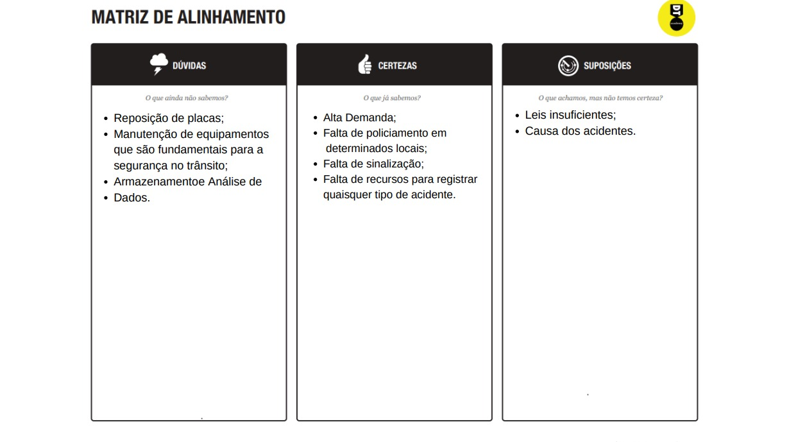

> * **Mapa de stakeholders**: 
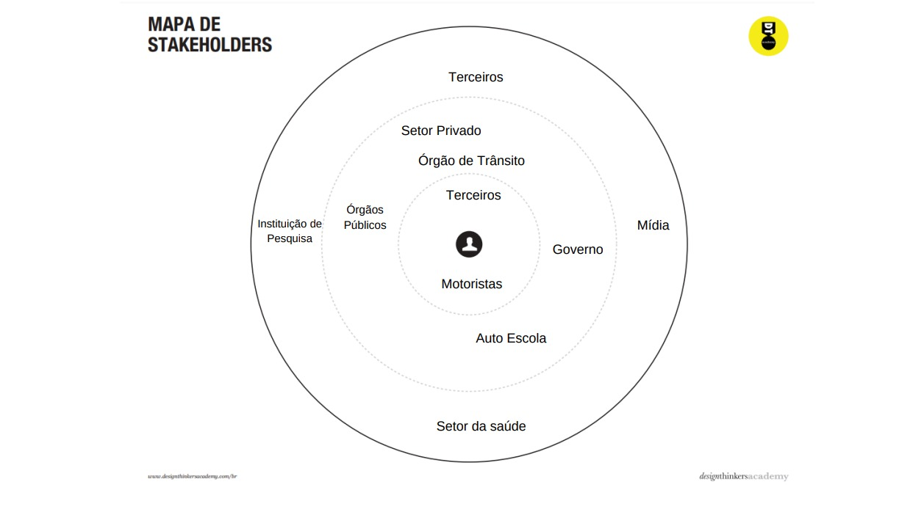

> * **Entrevistas qualitativas**: 
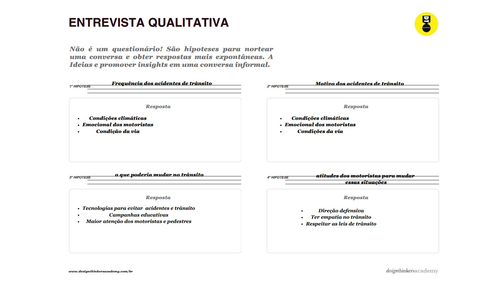

> * **Highlights de pesquisa**: 
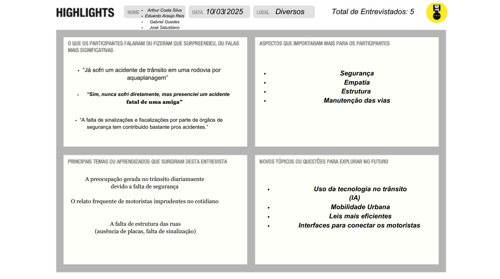

## Etapa de Definição

### Personas

* **Persona 1**:
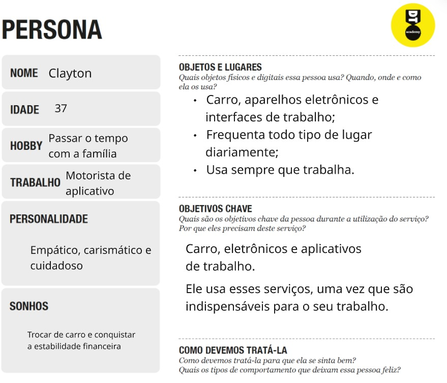

* **Persona 2**:
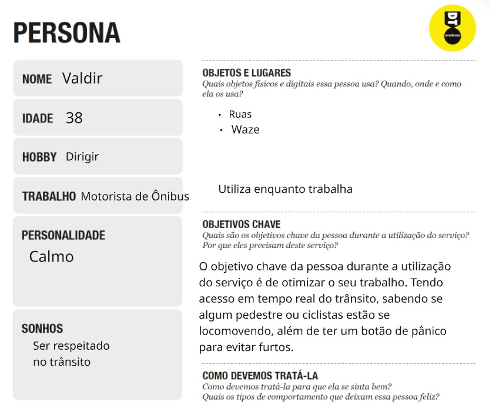

* **Persona 3**:
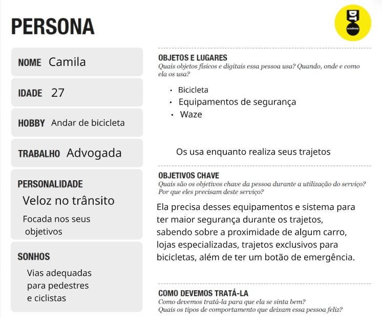

* **Persona 4**:
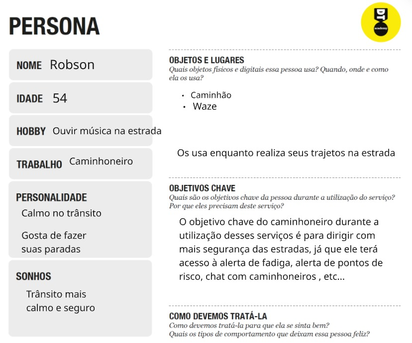

* **Persona 5**:
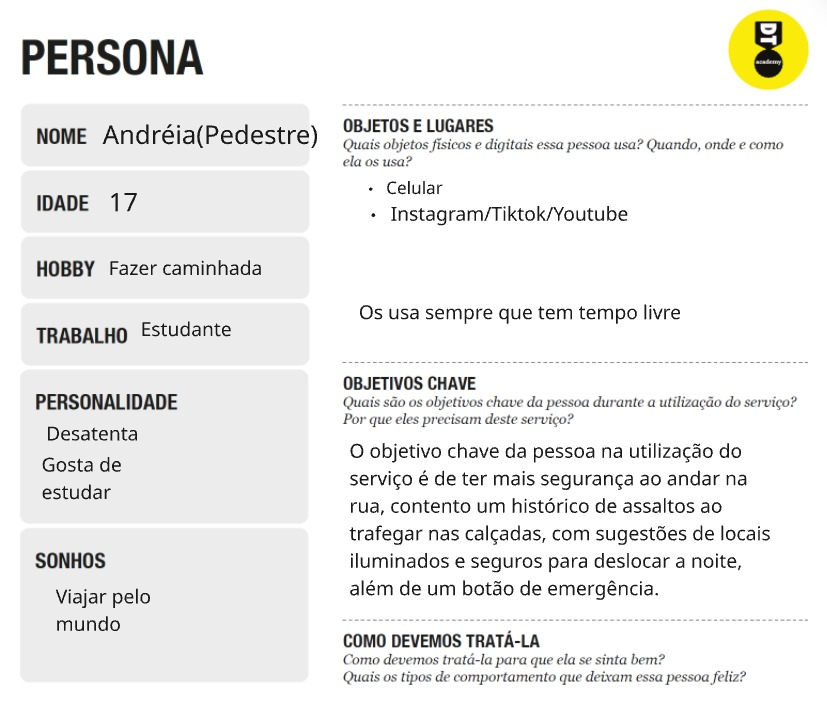


# Product Design


## Histórias de Usuários

Com base na análise das personas foram identificadas as seguintes histórias de usuários:

| EU COMO...`PERSONA` | QUERO/PRECISO ...`FUNCIONALIDADE`        | PARA ...`MOTIVO/VALOR`               |
| --------------------- | ------------------------------------------ | -------------------------------------- |
| Motorista Regular   | Saber por onde andar                     | Ter mais segurança no trânsito         |
| Ciclista            | Saber possíveis irregularidades presentes no trajeto     | Eu conseguir realizar minhas viagens com mais certeza que posso voltar bem para casa. |
| Pedestre         | Ter segurança para atravessar qualquer rua.     | Evitar acidentes por falta de sinalização |
| Motorista de Aplicativo         |Saber quais ruas evitar passar sempre que possível  |  Garantir segurança pro motorista e pro passageiro|
| Motoqueiro Regular       |   Saber quais locais eu posso ou não utilizar os corredores na via    |  Evitar que algum motorista me feche, gerando possíveis acidentes|
| Motoqueiro de Aplicativo         |Saber das melhores rotas para realizar minhas entregas  e Saber quais locais eu posso ou não utilizar os corredores na via  | Evitar locais indesejados e acidentes comigo e com o passageiro |
| Entregador (Correios) |   Saber se o cliente estará em casa ou não    | Para evitar rotas desnecessárias e o cliente demorar a receber sua encomenda |
| Caminhoneiro         | Saber os melhores locais de parada, além de saber locais de possíveis acostamentos se necessário  |Para não me desgastar durante a viagem, tornando-a perigosa  |
| Motorista de ônibus         |    Saber rotas alternativas para evitar trânsito e possíveis bloqueios inesperados nas vias.   |  Para não gastar tempo com atitudes de motoristas imprudentes e Como quando o motorista para a menos de 5 metros da esquina|
| Motorista de Estrada         |  Saber quais locais seguros para realizar uma ultrapassagem    |  Para otimizar as minhas viagens com segurança|


## Proposta de Valor

* **Proposta Persona 1**:
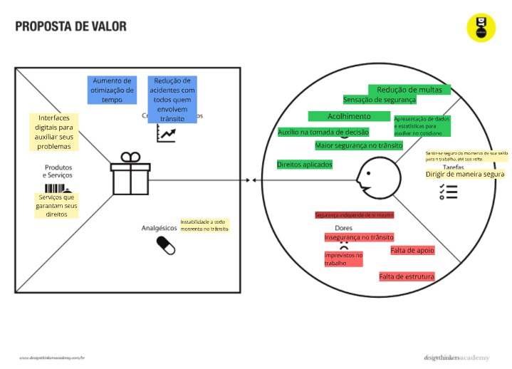

* **Proposta Persona 2**:
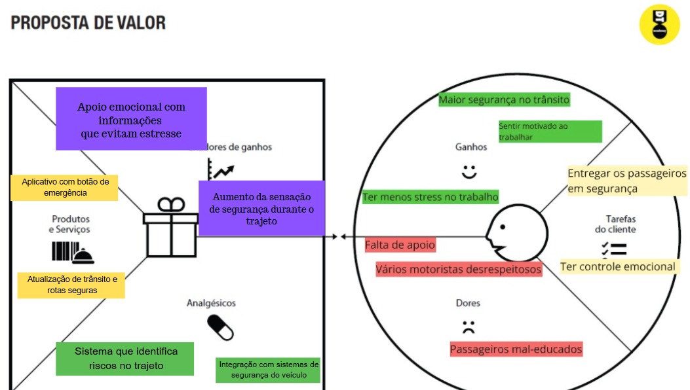

* **Proposta Persona 3**:
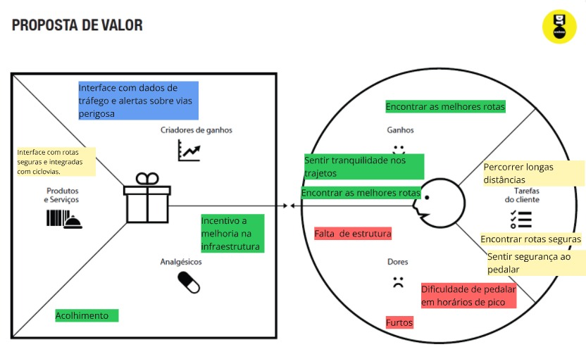

* **Proposta Persona 4**:
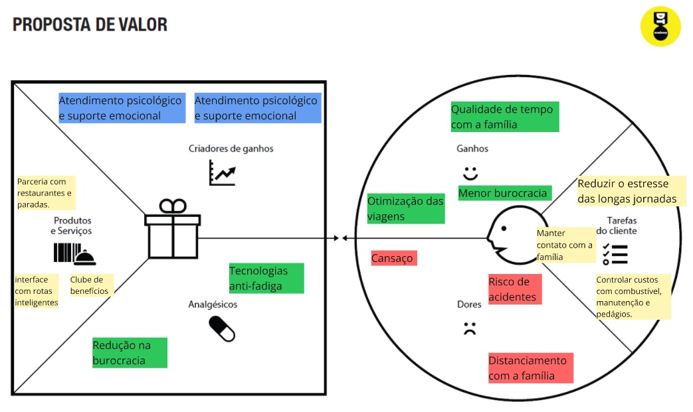

**Proposta Persona 5**:
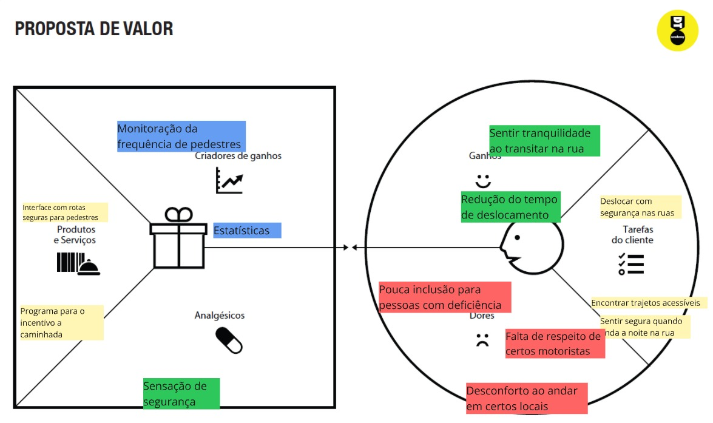

## Requisitos

As tabelas que se seguem apresentam os requisitos funcionais e não funcionais que detalham o escopo do projeto.

### Requisitos Funcionais

| ID     | Descrição do Requisito                                   | Prioridade |
| ------ | ---------------------------------------------------------- | ---------- |
| RF-001 | Cadastro de Usuários | ALTA       |
| RF-002 |Registro de infrações recorrentes  | MÉDIA     |
| RF-003 | Sistema de pontuação educativa   | MÉDIA     |
| RF-004 | Relatórios de comportamento no trânsito   | ALTA     |
| RF-005 |Campanhas interativas   | MÉDIA     |
| RF-006 | Simulações de risco  | ALTA     |
| RF-007 | Sistema de feedback comunitário  | MÉDIA     |
| RF-008 | Treinamento gamificado   | MÉDIA     |
| RF-009 | Botão de emergência para pedestres e ciclistas   | ALTA     |
| RF-010 | Integração com seguradoras e autoescolas  | BAIXA     |


### Requisitos não Funcionais

| ID      | Descrição do Requisito                                                              | Prioridade |
| ------- | ------------------------------------------------------------------------------------- | ---------- |
| RNF-001 |Escalabilidade   | ALTA     |
| RNF-002 | Botão de emergência para os Usuários    | ALTA      |

>
## Projeto de Interface


### Wireframes

Estes são os protótipos de telas do sistema.


Descrição para a tela XPTO

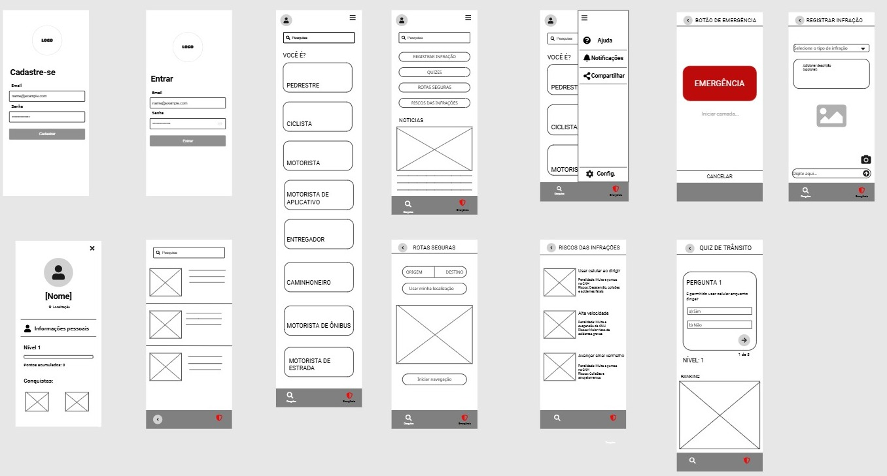


### User Flow


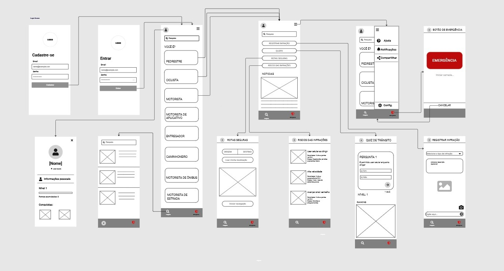


### Protótipo Interativo

✅ [Protótipo Interativo](https://embed.figma.com/proto/1SRUSdUpNZ0nNyK1eS3Jji/Prototipo?node-id=144-2471&p=f&scaling=scale-down&content-scaling=fixed&page-id=0%3A1&starting-point-node-id=144%3A2471&show-proto-sidebar=1&embed-host=share)

# Metodologia

Detalhes sobre a organização do grupo e o ferramental empregado.

## Ferramentas

Relação de ferramentas empregadas pelo grupo durante o projeto.

| Ambiente                    | Plataforma | Link de acesso                                     |
| --------------------------- | ---------- | -------------------------------------------------- |
| Processo de Design Thinking | Miro       | https://miro.com/      |
| Repositório de código       | GitHub     | https://github.com/    |
| Hospedagem do site          | Vercel     | https://vercel.com/    |
| Protótipo Interativo        | Figma      | https://www.figma.com/pt-br/  |
|                             |            |                                                    |


## Gerenciamento do Projeto

Utilizamos sprints como metodologia ágil no desenvolvimento do nosso projeto. A estrutura foi composta por três sprints, cada uma com duração aproximada de duas semanas. As tarefas foram distribuídas entre funcionalidades voltadas para apresentação de informações (como exibição de dados na interface e visualizações) e funcionalidades de cadastro (como formulários de entrada de dados).

 **Design Thinking** 
 Utilizamos o Design Thinking como metódo para compreendermos os usuários e os desafios que nosso projeto deveria atender. O processo foi dividido nas seguintes etapas:
 * Investigamos o contexto do problema, observamos as necessidades dos usuários por meio de pesquisas e entrevistas.
 * A partir das informações coletadas, construímos uma definição clara do problema a ser resolvido.
 * A equipe realizou sessões de brainstorming para gerar ideias criativas e inovadoras, priorizando as mais viáveis.
 * Criamos protótipos de baixa e média fidelidade para validar os fluxos e interfaces propostos.
 

# Solução Implementada

Esta seção apresenta todos os detalhes da solução criada no projeto.

## Funcionalidades

Esta seção apresenta as funcionalidades da solução.Info

##### Funcionalidade 1 - Cadastro e Avaliação de Denúncias

Permite incluir, visualizar, editar, excluir e avaliar denúncias de infrações de trânsito.

* **Instruções de acesso:**
  * Acesse o menu principal e escolha a opção "Realizar Denúncias".
  * Em seguida, registre uma nova denúncia ou avalie as denúncias já cadastradas.

* **Tela da funcionalidade**:

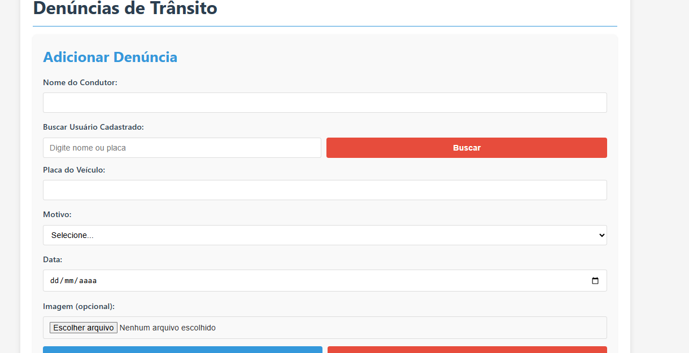

##### Funcionalidade 2 - Botão de Emergência

* **Instruções de acesso:**
  * Clique no botão localizado no canto inferior direito da tela para acessar a funcionalidade.
  * Em seguida, escolha o serviço de emergência (Polícia 190, Bombeiros 193, SAMU 192)
  * Confirme para realizar a ligação

* **Tela da funcionalidade**:

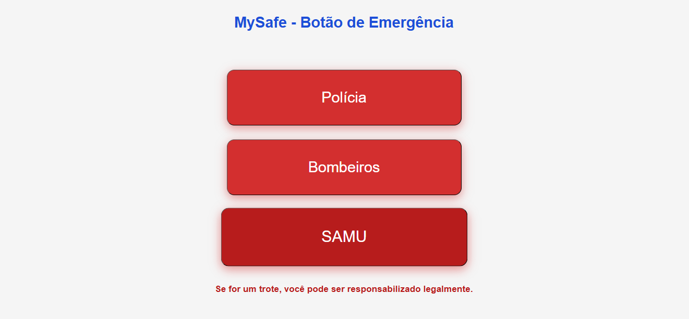

##### Funcionalidade 3 -Entrar em Contato

* **Instruções de acesso:**
  * Acesse o menu e escolha a opção "Entrar em Contato".
  * Em seguida, registre sua mensagem.

* **Tela da funcionalidade**:

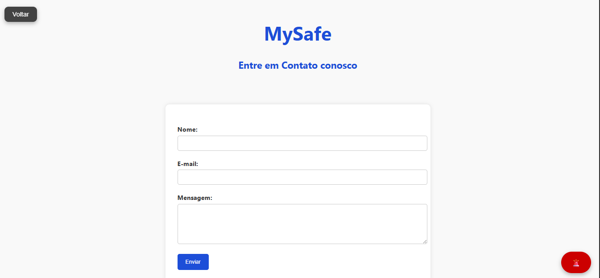

##### Funcionalidade 4 - Mapa Interativo

* **Instruções de acesso:**
  * Abra o site e efetue o login
  * Acesse o menu principal e escolha a opção "Mapa Interativo".
  * Em seguida, preencha os campos solicitados:
    Origem: Digite um endereço (ex: "Av. Paulista, São Paulo").
    Destino: Digite outro endereço.
    Modo de transporte: Selecione (Carro, Bicicleta, A Pé).
    Clique em "Calcular Rota".

* **Tela da funcionalidade**:

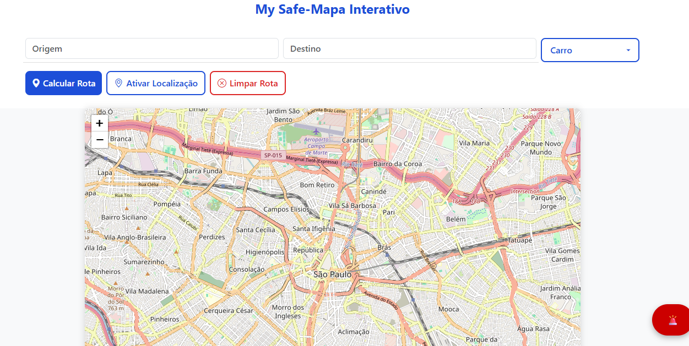


##### Funcionalidade 5 - Registro de Locais Seguros/Perigosos

* **Instruções de acesso:**
  * Acesse o menu principal e escolha a opção "Registro de Locais".
  * Em seguida, preencha os campos solicitados:
    Tipo de Usuário: Selecione (Ciclista, Motorista, Pedestre).
    Tipo de Local: Escolha "Seguro" ou "Perigoso".
    Nome do Local: Ex: "Esquina Escura"
    Descrição: Ex: "Falta de iluminação pública"
  * Filtre Locais usando o menu para ver apenas seguros ou perigosos no mapa.

* **Tela da funcionalidade**:

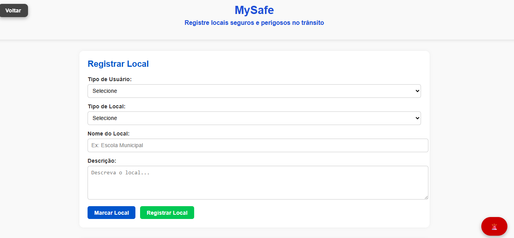

##### Funcionalidade 6 - Cadastro de Veículos

* **Instruções de acesso:**
  * Abra o site e efetue o login
  * Acesse o menu principal e escolha a opção "Cadastro de Veículos".
  * Em seguida, preencha os campos solicitados:
    Modelo do Veículo: Ex: Sacania R440
    Ano de Fabricação: Ex: 2018
    Tipo de Veículo: Selecione (Ex: carro)
    

* **Tela da funcionalidade**:

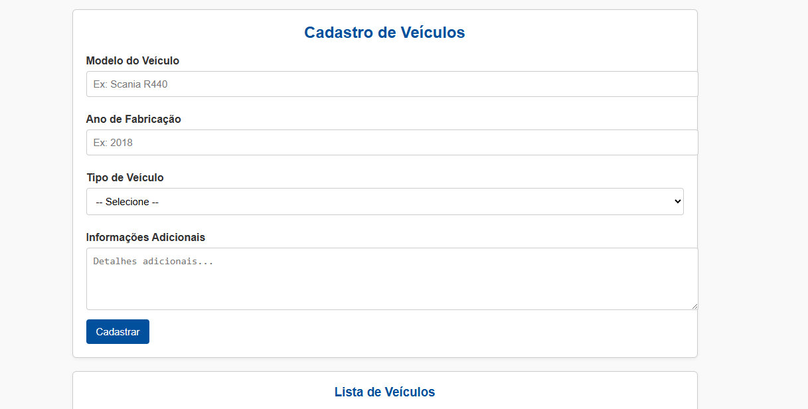

##### Funcionalidade 7 - Aulas

* **Instruções de acesso:**
  * Acesse o menu e escolha a opção "Aulas".
  * Em seguida, selecione a aula desejada.
    
* **Tela da funcionalidade**:

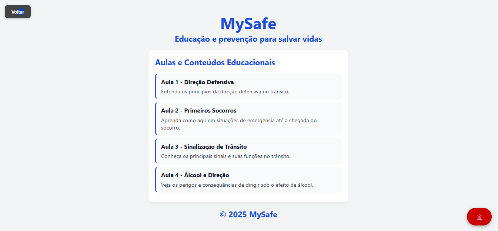


## Estruturas de Dados

Descrição das estruturas de dados utilizadas na solução com exemplos no formato JSON.Info

##### Estrutura de Dados - Cadastro de Denúncias 

Registro e Avaliação de Denúncias de Infrações de Trânsito

```json
  {
  "denuncias": [
    {
      "id": 1,
      "nome": "Eva Silva",
      "placa": "AE5521",
      "motivo": "Não usou cinto de segurança",
      "descricao": "O motorista estava sem cinto enquanto dirigia.",
      "data": "2023-09-21",
      "imagem": ""
    }
  ],
  "avaliacoes": [
    {
      "id": 1,
      "denunciaId": 1,
      "avaliadorNome": "Lana Santos",
      "avaliadorTipo": "Motorista",
      "veracidade": 4,
      "comentario": "A denúncia parece correta, testemunhei o ocorrido.",
      "data": "2023-10-22"
    }
  ]
}
  
```

##### Estrutura de Dados - Cadastro de Veículos

Registro de Veículos Cadastrados

```json
  {
  "veiculos": [
    {
      "id": 1,
      "modelo": "Ford Ka",
      "anoFabricacao": 2022,
      "tipo": "moto",
      "informacoesAdicionais": ""
    }
   ]
  }
```
##### Estrutura de Dados - Locais Seguros

Realiza o cadastro e a gestão de informações sobre locais considerados seguros.

```json
 {
  "locais": [
    {
      "id": 1,
      "usuario": "Ciclista",
      "tipo": "perigoso",
      "nome": "Cruzamento da Rua A com Av. B",
      "descricao": "Ponto cego frequente com acidentes entre carros e bicicletas",
      "endereco": "Rua A, 100 - Centro, Belo Horizonte/MG"
    }
  ]
}
```

##### Estrutura de Dados - Cadatro de Usuários

Permite o registro informações dos usuários do sistema.

```json
 {
  "usuarios": [
    {
      "id": 1,
      "nome": "Ana Silva",
      "email": "ana@email.com",
      "senha": "$2a$10$N9qo8uLOickgx2ZMRZoMy...",
    }
  ]
 }
```
## Testes
* Espera-se que as funcionalidades de cadastro sejam devidamente listadas e que as informações sejam apresentadas de forma correta.

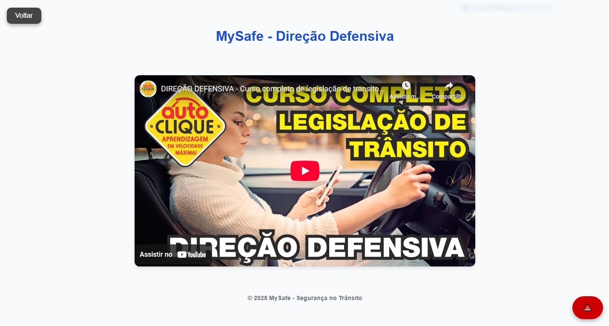

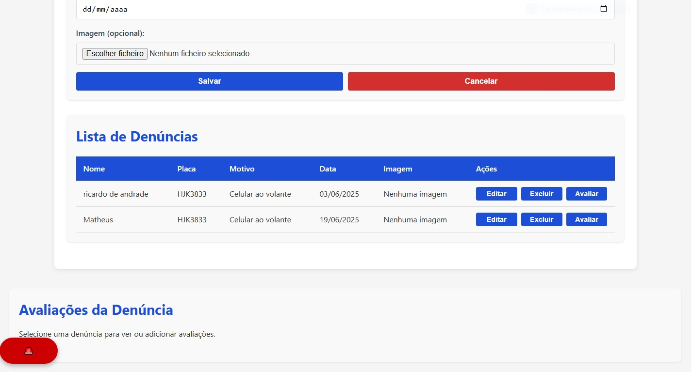

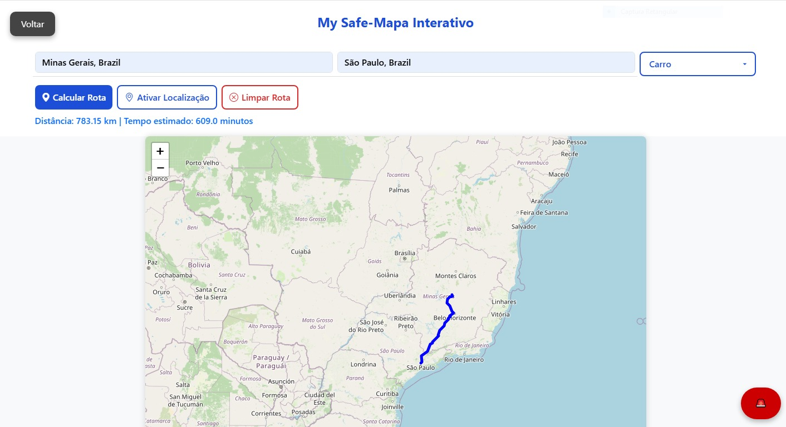

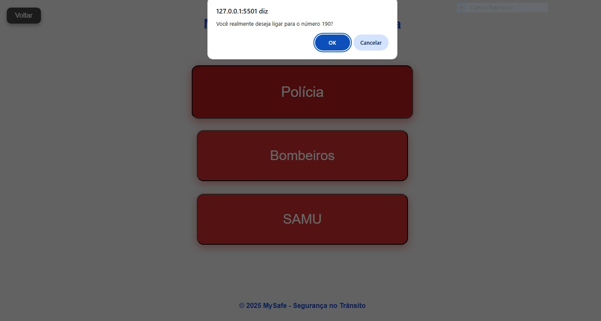

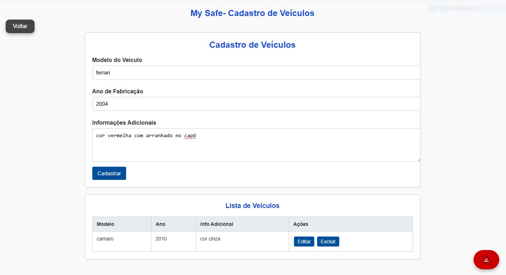

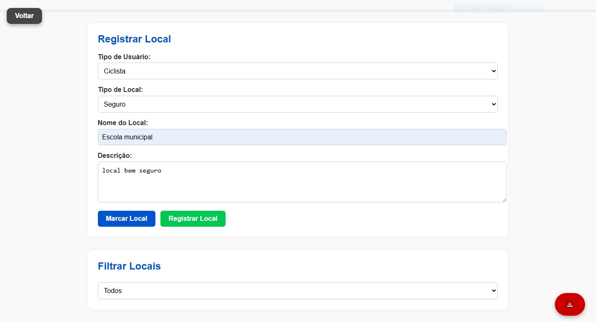


## Módulos e APIs

Esta seção apresenta os módulos e APIs utilizados na solução

**Mapas e Geocodificação**:

* Leaflet JS - [https://leafletjs.com/](https://leafletjs.com/) 
* OpenStreetMap - [https://www.openstreetmap.org/](https://www.openstreetmap.org/) 
* Nominatim (OSM Geocoding) - [https://nominatim.openstreetmap.org/](https://nominatim.openstreetmap.org/) 
* Photon (Komoot) - [ https://photon.komoot.io/]( https://photon.komoot.io/) 
* OpenRouteService - [https://openrouteservice.org/](https://openrouteservice.org/) 

**APIs do Navegador:**

* Geolocation API - [https://developer.mozilla.org/en-US/docs/Web/API/Geolocation_API](https://developer.mozilla.org/en-US/docs/Web/API/Geolocation_API) 
* LocalStorage API - [https://developer.mozilla.org/en-US/docs/Web/API/Window/localStorage](https://developer.mozilla.org/en-US/docs/Web/API/Window/localStorage) 
* Fetch API - [https://developer.mozilla.org/en-US/docs/Web/API/Fetch_API](https://developer.mozilla.org/en-US/docs/Web/API/Fetch_API) 

**Bibliotecas Externas::**

* Bootstrap Icons - [https://icons.getbootstrap.com/](https://icons.getbootstrap.com/) 
* Bootstrap 5 - [https://getbootstrap.com/](https://getbootstrap.com/) 


# Referências

As referências utilizadas no trabalho foram:

* BRASIL. Lei nº 9.503, de 23 de setembro de 1997. Institui o Código de Trânsito Brasileiro. In: CÂMARA DOS DEPUTADOS. Código de Trânsito Brasileiro. 4. ed. Brasília: Edições Câmara, 2010. 297 p. (Série legislação; n. 26).
* BACCHIERI, Giancarlo; BARROS, Aluísio J. D. Acidentes de trânsito no Brasil de 1998 a 2010: muitas mudanças e poucos resultados. Revista de Saúde Pública, São Paulo, v. 45, n. 5, p. 949–963, out. 2011.


> 